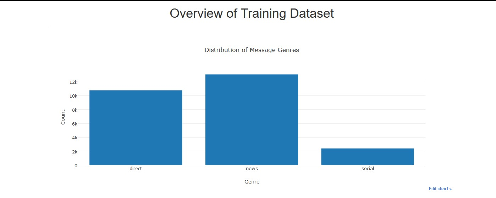
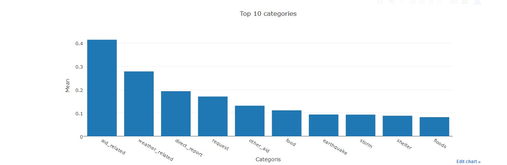
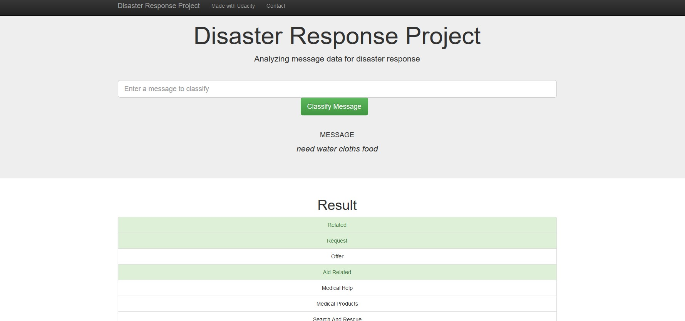
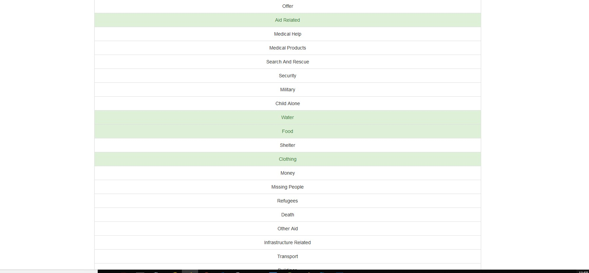
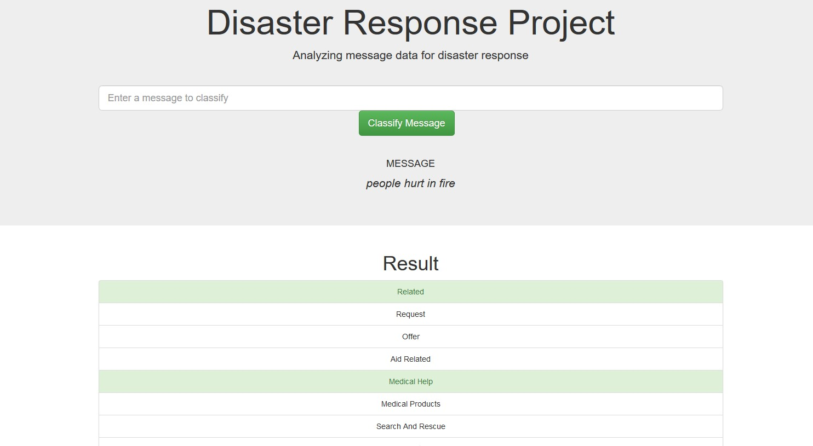
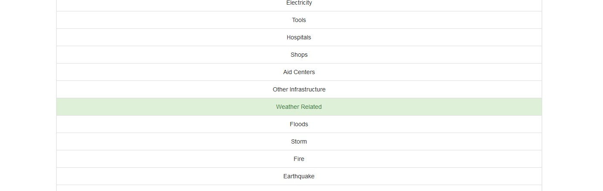

## Hello and Welcome !
Here you will find my files and code for the Disaster Response Pipeline Project
This project combines multiple activities
  - ETL activities
  - ML activities (including NLP activities)
  - Deployment (as a web application that takes a disaster message as input and displays the categories and actions possible)
    
## Project Background:
  This project is based on a project by FigureEight. The company collected data on categories of disasters and messages that were sent by people to analyze and organize proper responses to any disaster.
  This implementation merges, cleans and then creates a SQL database that will be used by a Machine Learning model to categorize the data.
  Following this a web application is used to solicit disaster messages and then displays categories that may fit the message so that aid/response can be properly directed. 
  
 ## Workspace (folder) structure:
 
   **/app** : containes the files for the implementation of the web application
        - /templates - this folder contains the .html needed for the web app
        - run.py - this program executes the web app and displays the interface at /localhost:3001/
 
   **/data** : containes the messages and categories (CSV) files and will contain the newly created SQL database file
        - disaster_messages.csv : all messages data
        - disaster_categories.csv : all categories data 
        - DR.db : Output of the ETL process as a SQL database
        - process_data.py : program that merges, cleans and processes the data and creates the SWL database
 
   **/models** : containes the classifier code
        - train_classifier.py : the ML model training and creation program. This will save the trained model as a PICKLE file
        - classifier.pkl : output of train_classifier.py program
        
## Environment:
  Programs were developed in Python 3. Key libraries 
  
## Instructions:
  From the root directory please execute these steps:
  1.  *python data/process_data.py data/disaster_message.csv data/disaster_categories.csv data/DR.db* 
  
      **Please note you may have to delete DR.db if it already exists**
      
      - This step will Extract, Transform and Load (ETL) the messages and categories that were collected as input to the project
      
      - The output will be a SQL table in a SQL database
      
  2.  *python models/train_classifier.py data/DR.db dr_project.sav*
  
      **Please use the same DB that was created in the last step**
      
      - This step will execute the Machine Learning (ML) part of the project by training the classifier model and saves it
      
  3.  *python app/run.py*
      
      - This program will execute the web app and use the trained model to classify operator input and display the interpreted data and action group.
 

## Dataset statistics - a sample

## Test case 1: Need water cloths and food 

## Test case 2: People hurt in fire

